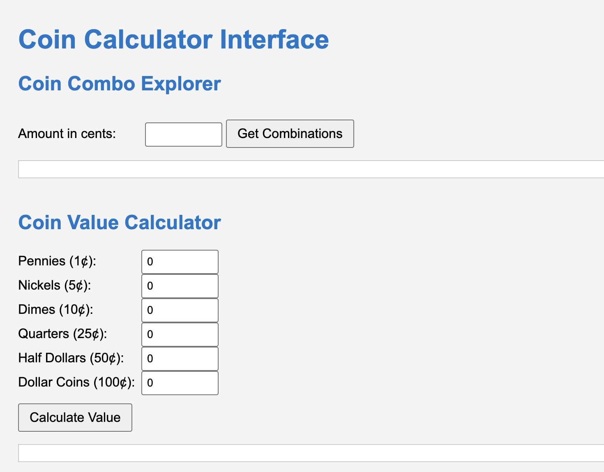
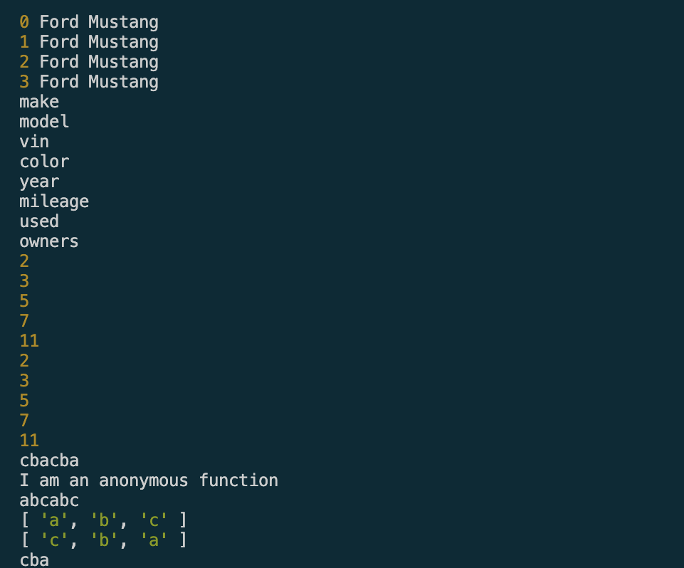

# Project 3: Ultimate Coin Tool Web App

Welcome to my Project 3 page for **CIT 281**.

---

## Purpose

This project focused on creating a web-based coin calculator using a Node.js REST API with Express. It emphasized modular programming, API routing, and responding with JSON data.

---

## Technologies Used

- Node.js
- Express.js
- JavaScript Modules
- REST API Design
- JSON
- Visual Studio Code (VSCode)

---

## Lab 3: Modern JavaScript and Modular Node.js

This lab focused on modern JavaScript practices like using arrow functions, destructuring, the spread operator, and creating/importing Node.js modules to refactor and organize code more efficiently.

---

## What I Learned

- How to build and test a RESTful API with Express.
- Creating and using custom JavaScript modules.
- Structuring server responses with JSON.
- Handling query parameters in GET requests.
- Debugging and testing routes using Postman.

---

## Project Images

---

## Lab Images

---

Thanks for visiting my Project 3 page!

[Back to Portfolio](https://arissas24.github.io/)
